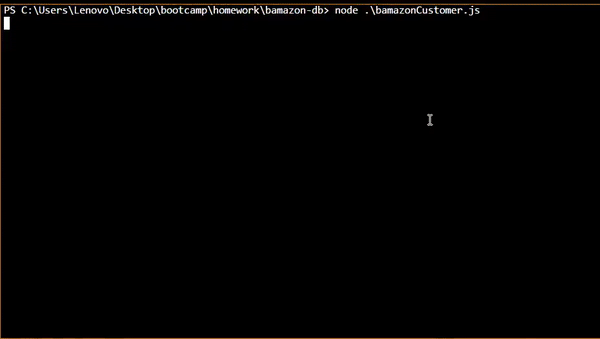

# Bamazon

## Overview

This is an "Amazon-like" storefront in **Node.js** with **MySQL**. The app can take orders from customers and deplete stock from the store's inventory.

### How does it work?
As the user run this app a list of all the product in the store will appear, showing the item ID, name, department, price, and content in the store.
The user can choose which item, and how much of that item to purchase.

> if the amount of product the user wishes to buy is in store stock, the user will get the total sum of the purchase and the stock will be updated in the database.

> if the amount of product the user wishes is more than what's in the stock - no purchases will execute and the user will be notified.

### Why does it useful?
This is a great example of using backend code to read and edit data from SQL database through Node.js.